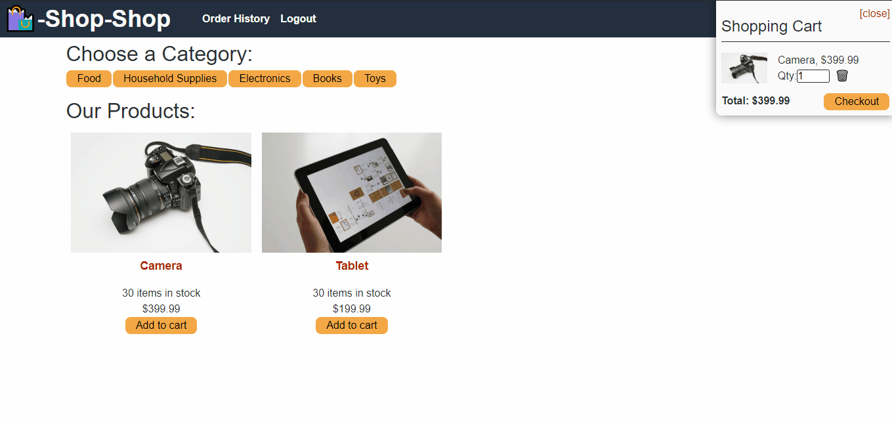

# 22 State: Redux Store (Extra Credit)

## Your Task

In this module, you learned how to manage global state using React’s Context API. The Context API is quickly gaining traction as a worthy alternative or perhaps even successor to other libraries that manage global state in tandem with React, such as Flux or MobX. Nonetheless, the open source JavaScript library Redux remains the industry standard for managing complex state in a large-scale React application, and you’ll likely encounter it on the job.

Your challenge this week is to refactor the e-commerce platform from [Activity 26](http://static.fullstack-bootcamp.com/fullstack-ground/unit-22/26-Stu_Actions-Reducers.zip) so that it uses [Redux](https://redux.js.org/). You won’t need to make sweeping changes to the code, but you will need to read through the Redux documentation on your own to find the information you need. Some guidelines have been provided in the Getting Started section to point you in the right direction. If you haven't yet, download the [e-commerce platform code from Activity 26](http://static.fullstack-bootcamp.com/fullstack-ground/unit-22/26-Stu_Actions-Reducers.zip).

**On the Job**: Web developers frequently have to immerse themselves in a new technology to solve a problem, with only that tool’s documentation for help. They must sift through it to find the information that matches the specific problem they’re trying to solve. This assignment will allow you to practice a skill that you’ll use many times over the course of your career.

Remember, this module's Challenge is extra credit. It is not required for submission, nor will it count towards one of the two assignments that you can skip. If you choose to submit this Challenge, you will receive extra credit points on your final grade. However, if you choose not to submit it, your final grade will not be affected in any way. This Challenge is an opportunity for you to further practice your skills and get feedback on it, with the added incentive of receiving extra credit for the work.

## User Story

```md
AS a senior engineer working on an e-commerce platform
I WANT my platform to use Redux to manage global state instead of the Context API
SO THAT my website's state management is taken out of the React ecosystem
```

## Acceptance Criteria

```md
GIVEN an e-commerce platform that uses Redux to manage global state
WHEN I review the app’s store
THEN I find that the app uses a Redux store instead of the Context API
WHEN I review the way the React front end accesses the store
THEN I find that the app uses a Redux provider
WHEN I review the way the app determines changes to its global state
THEN I find that the app passes reducers to a Redux store instead of using the Context API
WHEN I review the way the app extracts state data from the store
THEN I find that the app uses Redux instead of the Context API
WHEN I review the way the app dispatches actions
THEN I find that the app uses Redux instead of the Context API


# 22 State: Redux Store (Extra Credit)
  [](https://opensource.org/licenses/MIT)

  ### Table of Content
  * [Description](#description)
  * [Installation](#installation)
  * [Usage](#usage)
  * [Contributing](#contributing)
  * [Developer Information](#developer-information)
  * [License](#license)

  ### Description:
  The project is an assignment of a coding bootcamp program, with the purpose for students learn how to use MERN stack, MongoDB, Express.js and Node.js. The application is a platform where users can search for books and add or delete their favorites to a list.

  ### Installation:
  - Clone the initial code git repository.
  - Navigate on the terminal to the directory book-search-engine where the code was cloned to.
  - Type "npm i" and "npm start".
  - Set up an Apollo Server to use GraphQL queries and mutations to fetch and modify data, replacing the existing RESTful API.
  - Modify the existing authentication middleware so that it works in the context of a GraphQL API.
  - Create an Apollo Provider so that requests can communicate with an Apollo Server.
  - Deploy the application to Heroku.

  ### Usage:
  [Click here](https://) to access the deployed application. GIVEN a book search engine:
  - WHEN I load the search engine THEN I am presented with a menu with the options Search for Books and Login/Signup and an input field to search for books and a submit button
  - WHEN I click on the Search for Books menu option THEN I am presented with an input field to search for books and a submit button
  
  - WHEN I am not logged in and enter a search term in the input field and click the submit button THEN I am presented with several search results, each featuring a book’s title, author, description, image, and a link to that book on the Google Books site
  - WHEN I click on the Login/Signup menu option THEN a modal appears on the screen with a toggle between the option to log in or sign up
  - WHEN the toggle is set to Signup THEN I am presented with three inputs for a username, an email address, and a password, and a signup button
  - WHEN the toggle is set to Login THEN I am presented with two inputs for an email address and a password and login button
  - WHEN I enter a valid email address and create a password and click on the signup button THEN my user account is created and I am logged in to the site
  - WHEN I enter my account’s email address and password and click on the login button THEN I the modal closes and I am logged in to the site
  - WHEN I am logged in to the site THEN the menu options change to Search for Books, an option to see my saved books, and Logout
  - WHEN I am logged in and enter a search term in the input field and click the submit button THEN I am presented with several search results, each featuring a book’s title, author, description, image, and a link to that book on the Google Books site and a button to save a book to my account
  
  - WHEN I click on the Save button on a book THEN that book’s information is saved to my account
  - WHEN I click on the option to see my saved books THEN I am presented with all of the books I have saved to my account, each featuring the book’s title, author, description, image, and a link to that book on the Google Books site and a button to remove a book from my account
  - WHEN I click on the Remove button on a book THEN that book is deleted from my saved books list
  
  - WHEN I click on the Logout button THEN I am logged out of the site and presented with a menu with the options Search for Books and Login/Signup and an input field to search for books and a submit button  

  ### Contributing
  I have received advice from the UC Berkeley Extension tutor Matthew Calimbas on debugging and testing my code. I also reached out to the [Mozilla Developer](https://developer.mozilla.org/en-US/) webpage and [NPM Docs](https://docs.npmjs.com/) for documentation.

  ### Developer Information:
  - Virginia Freitas
  - GitHub URL: https://github.com/virginiafreitas
  - e-mail address: virginiacdefreitas@gmail.com
```

## Mock-Up

This section reviews the web application's general appearance and functionality.

The following animation shows how a user can register using the Signup page and then navigate to the Products page:


The following animation shows how the user can select a category, choose a product, view details about it on the product page, and add and remove it from their shopping cart:


Finally, the user can check out by going to their shopping cart, as shown in the following animation:



## Getting Started

For instructions to add Redux to your application, refer to the [Redux Fundamentals basic tutorial](https://redux.js.org/basics/basic-tutorial). Note that the documentation will refer to additional packages that you'll need to complete this implementation.

Be sure to review ALL of the documentation, because there are newer methods that can make these tools much easier to implement. React has gone through several iterations; as such, some React-and-Redux tutorials will assume that you aren't using Hooks.

You'll use the Stripe API to process payments, which includes making front-end and back-end changes. Don't worry, Stripe provides test credentials, so you won't need to use a real credit card to try it out. Refer to the [Stripe docs on testing your integration](https://stripe.com/docs/testing).

**Important**: The Challenge requires a specific version `(>=7.0)` of `npm` in order to install peer dependencies like GraphQL when deploying to Heroku. By default, Heroku uses `npm 6.x`, which may cause some issues. Be sure to refer to the [Heroku Docs on Specifying an NPM Version](https://devcenter.heroku.com/articles/nodejs-support#specifying-an-npm-version) to ensure your `package.json` file is set up correctly, as shown in the following snippet:

  ```json
  {
    "engines": {
      "npm": "7.x"
    }
  }
  ```

## Grading Requirements

> **Note**: If a Challenge assignment submission is marked as “0”, it is considered incomplete and will not count towards your graduation requirements. Examples of incomplete submissions include the following:
>
> * A repository that has no code
>
> * A repository that includes a unique name but nothing else
>
> * A repository that includes only a README file but nothing else
>
> * A repository that only includes starter code

This Challenge is graded based on the following criteria:

### Technical Acceptance Criteria: 40%

* Satisfies all of the preceding acceptance criteria plus the following:

  * Retains all the functionality of the original application.

  * Application must be deployed to Heroku.

### Deployment: 32%

* Application deployed at live URL.

* Application loads with no errors.

* Application GitHub URL submitted.

* GitHub repository contains application code.

### Application Quality: 15%

* User experience is intuitive and easy to navigate.

* User interface style is clean and polished.

* Application resembles the mock-up functionality provided in the Challenge instructions.

### Repository Quality: 13%

* Repository has a unique name.

* Repository follows best practices for file structure and naming conventions.

* Repository follows best practices for class/id naming conventions, indentation, quality comments, etc.

* Repository contains multiple descriptive commit messages.

* Repository contains high-quality README file with description, screenshot, and link to the deployed application.

## Review

You are required to submit BOTH of the following for review:

* The URL of the functional, deployed application.

* The URL of the GitHub repository, with a unique name and a README describing the project.

---

© 2023 edX Boot Camps LLC. Confidential and Proprietary. All Rights Reserved.
